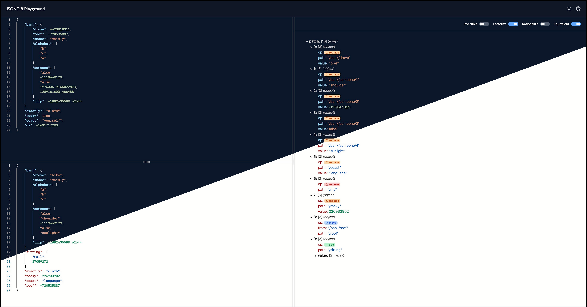

# `jsondiff` Playground

A playground for [**wI2L/jsondiff**](https://github.com/wI2L/jsondiff). Supports all the [options](https://github.com/wI2L/jsondiff#diff-options) of the package.



## Getting started

To run the application locally, first install the dependencies, and launch the development server using the following commands:

```bash
$ npm install
$ npm run dev
```

Open http://localhost:3000 in your browser to access the application.
