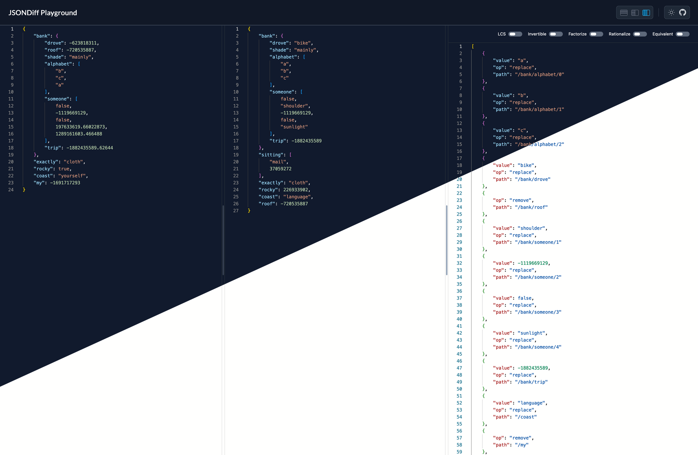

# `jsondiff` Playground

A playground for [**wI2L/jsondiff**](https://github.com/wI2L/jsondiff). Supports *most of* the [options](https://github.com/wI2L/jsondiff?tab=readme-ov-file#options).



## Getting started

To run the application locally, first install the dependencies, and launch the development server using the following commands:

```bash
$ npm install
$ npm run dev
```

Open http://localhost:3000 in your browser to access the application.

### Tree view

You can switch between a raw JSON output view to a Tree view to visualize the resulting patch. Use the <kbd>⌃ Control</kbd> + <kbd>V</kbd> keyboard shortcut to switch between the two.

## Tech stack

- [Vue.js](https://vuejs.org/)
- [Vite.js](https://vitejs.dev/)
- [TailwindCSS](https://tailwindcss.com/)
- [VueUse](https://vueuse.org/)
- [WebAssembly (WASM)](https://webassembly.org/)
